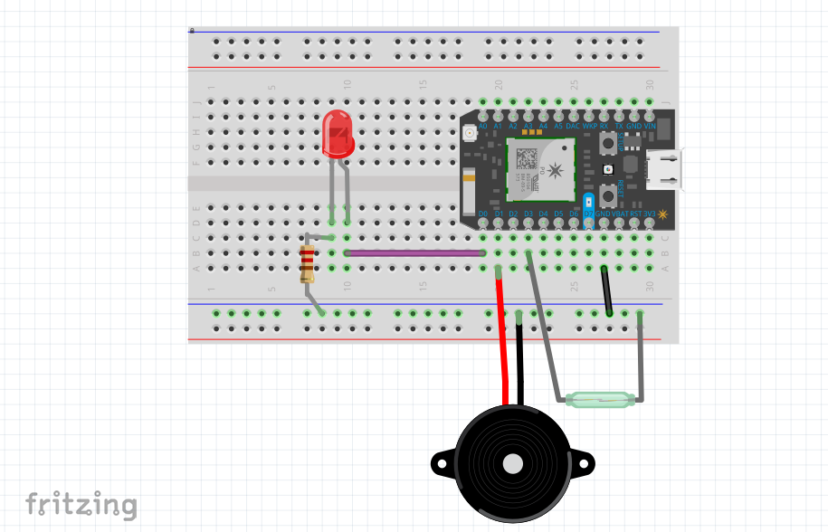

# Photon Door Sensor Alarm

This is an example on how to wire up a door sensor and activate a piezo alarm. When the door is opened, an LED will light up and a tone will play. Using [WebHooks](https://docs.particle.io/guide/tools-and-features/webhooks/), you could record this data into a database or send a text message with the [Twilio API](https://www.twilio.com/).

### Required Parts

- [Large Piezo Alarm](https://www.sparkfun.com/products/13940) $2.95
- [Photon Core](https://store.particle.io/) $19.00
- [Breadboard](https://www.sparkfun.com/products/12002) $4.95
- Door Sensor [Recessed](https://www.amazon.com/Honeywell-Ademco-956RPT-WH-Plunger-Terminals/dp/B000GUTN34/) or [Surface Mount](https://www.amazon.com/gp/product/B01N217763) $10.00
- Green or Red LED $1
- Misc wires and resistor $2

**Total Project Cost: ~$39.90 + tax & shipping costs**

## Wiring

For the complete schematic, open the [door-sensor-alarm.fzz](https://github.com/blackcj/PhotonDoorSensorAlarm/blob/master/images/door-sensor-alarm.fzz) file in [Fritzing](http://fritzing.org/home/).

## Code

See the [door-sensor-alarm.ino](https://github.com/blackcj/PhotonDoorSensorAlarm/blob/master/door-sensor-alarm.ino) file.

### WebHook

You could optionally create a [WebHook](https://docs.particle.io/guide/tools-and-features/webhooks/) that makes an API request when the door is open. This would allow you to record each open and close event.

## Resources

- [Particle Tone](https://docs.particle.io/reference/firmware/photon/#tone-)
- [Spark Fun Speaker Hookup](https://learn.sparkfun.com/tutorials/sparkfun-inventors-kit-for-photon-experiment-guide/experiment-5-music-time)
- [Pitch to Frequency Mappings](http://peabody.sapp.org/class/st2/lab/notehz/)
- [Garage Door Status](https://www.hackster.io/team-wireless-marvels-inc/garage-door-status-alert-to-sms-text-bc52f0)
- [Spark Fun Home Security](https://learn.sparkfun.com/tutorials/sparkfun-inventors-kit-for-photon-experiment-guide/experiment-9-home-security)
